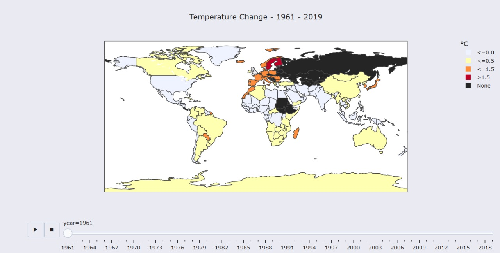

# Warming_Earth_Climate_Patterns_Across_the_Globe

# Project Description
This project provides a comprehensive analysis of global temperature changes from 1961 to the most recent available data using historical climate records. By leveraging powerful data science tools and libraries, the analysis reveals spatial and temporal climate trends affecting our planet.

---

# Through data wrangling and rich visualization, this project aims to:
📈 Identify countries most and least affected by the temperature rise in the last decade.

🍁 Explore seasonal variations and their relationship with climate patterns.

🌐 Visualize global trends and anomalies using heatmaps, choropleth maps, and animated charts.

📊 Track climate evolution across time and geographies.

🔬 The results of this project are visualized with intuitive and interactive plots to promote better understanding and awareness of climate change patterns.

---

# Tools & Technologies
🐍 Python

🧪 Pandas, NumPy – for data processing

📊 Seaborn, Matplotlib, Plotly – for visualizations

🌐 PyTrends – Google Trends data extraction

🌍 Plotly Choropleth Maps – for geospatial search mapping

---

# 🧠 Key Insights

🌡️ Northern & Eastern Europe, Arctic zones have seen >1.5°C rise in temperatures.

🌴 Tropical regions remain relatively stable, but seasonal swings are evident.

📉 A strong upward trend in anomalies post-1990 suggests alarming acceleration.

🧭 Some regions lack full temperature records, highlighting gaps in global monitoring.

---
Visualization

